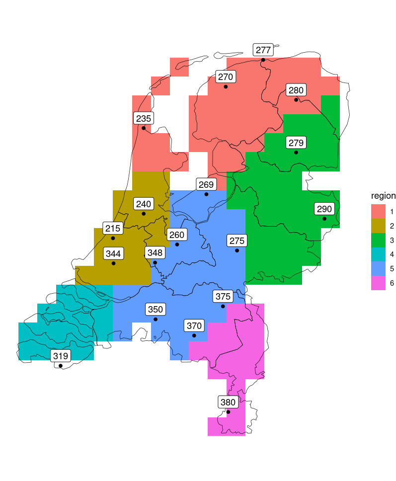

## Contents
[[_TOC_]]

## Introduction

This user manual is intended to help users define and run simulations with the air quality model OPS, developed at RIVM. OPS simulates the atmospheric process sequence of emission, dispersion, transportation, chemical conversion and deposition, and its main purpose is to calculate the concentration and deposition of pollutants (e.g. particulate matter, acidifying compounds like $SO_2$, $NO_x$ and $NH_3$) for the Netherlands using a high spatial resolution (typically 1 $\times$ 1 km).  The model is, however, set up as a universal framework supporting the modelling of other pollutants (such as fine particles and persistent organic pollutants) and different resolutions.

Processes simulated with the OPS model as well as input and output parameters are extensively documented in the OPS model description, which can be downloaded from the [OPS website](https://www.rivm.nl/operationele-prioritaire-stoffen-model) - "Documentatie" - "Uitgebreide modelbeschrijving". Where needed, this manual refers to the OPS-documentation.

This chapter defines the application area of the model in terms of chemical characterisation of substances, emission source types, source and receptor domain and time resolution.

###	Chemical characterisation of substances
The OPS model works with three groups of substances:

1.	Acidifying substances ($SO_2$, $NO_x$, $NH_3$ and secondary products).
The properties of acidifying substances are defined within the model.

2.	Non-acidifying (gaseous) substances. 
The group of non-acidifying substances uses a generic approach in which the properties of the substance are expressed in general terms such as:
    -	a chemical conversion/degradation rate
    -	a dry deposition velocity or a surface resistance
    -	a wet scavenging ratio.

3.	Particle-bounded substances.
A generic approach is followed for substances attached to particles in which the size distribution of the particles defines their atmospheric behaviour.

## Emissions
###	Source area
The model describes the transport of substances over greater distances, with wind fields generated from the temporal behaviour of wind direction, wind speed, atmospheric stability and mixing height averaged over meteorological regions in the Netherlands. 
The source area for this model has been set at a circle with a radius of 1000 km, with the Netherlands as the centre. 
The contribution of sources in this area to concentration and deposition in the Netherlands may be calculated for countries individually. 
The contribution of sources outside this area, but within Europe, can be estimated, but with less accuracy. 
The calculation of country-specific contributions from outside this area is probably not meaningful. 

###	Source types
The OPS model distinguishes the following source types:

a. Point sources:
-	source height ≥ 0 m
-	negligible diameter
-	with or without heat content or exit velocity.

b. Area sources:
-	source height ≥ 0 m
-	diameter ca. 10 m – 500 km
-	square or circular
-	with or without (average) heat content or (average) exit velocity
-	standard deviation of the source height (from 0 m to average source height).

For both source types, a diurnal emission variation and a particle-size distribution can be specified. Emissions of either type can be input to the model in any number and in any combination.
For more information on emissions, see section [Emission file](#emission-file).

###	Meteorological statistics

#### Meteorological time-scale
The OPS model calculates long-term average concentrations and depositions. 
In fact, the period for which the calculations are representative is entirely determined by the period for which the meteo-statistics have been made. 
At present, information is available for individual years since 1981. Long-term climatological data in the model is based on 2005 - 2014 data. 
In addition to the standard (multi-year) averages, the OPS model can also calculate concentrations and depositions for shorter periods (specific year, season, month); special statistics will have to be compiled for such periods and these statistics are not part of the standard distribution of OPS.

#### Meteorological area
In the standard situation, the model interpolates the meteorological data of nearby regions to the position of the selected receptor. 
The user of the model can disconnect the automatic coupling of meteorological data and receptor position by selecting one of the six (standard) meteorological regions in the Netherlands or the Netherlands as a whole, see Figure 1. 


<br>*Figure 1. Meteorological regions in OPS.*

###	Receptor characteristics
Receptor points for calculating concentrations and depositions are characterised by their coordinates, height, land use type and roughness length. 
Receptor points can be chosen 

- on a regular (Cartesian) grid, with a grid distance to be chosen. The domain may be pre-defined (the Netherlands) or defined by the user; 
- for a number of specific locations to be defined by the user. 

The latter option is especially useful when results have to be compared with observations. 
When the user selects grid output, OPS automatically generates multiple sub-receptors inside a grid cell in order to be able to compute a representative grid cell average. 
The number of sub-receptors goes to 1 with increasing source-receptor distance.

The default receptor height is 4 m within the OPS model, but the user can alter this height for specific receptors. 


#### Receptor domain
The area for which concentrations and depositions can be calculated is determined by the size of the area for which meteorological parameters are known. 
Since the standard climatological data set used for this model is based on observations from the Royal Netherlands Meteorological Institute (KNMI), the maximum size of the receptor area becomes, in effect, the Netherlands and adjoining regions. 
Land use and terrain roughness data maps, covering only the Netherlands in great detail, also impose limitations. 


#### Minimum source – receptor distance
This model does not explicitly take into account the direct influence of obstacles (e.g. forests, multiple buildings) on the dispersion. 
Instead, the general influence of obstacles is expressed in the terrain roughness variable, assuming that obstacles are homogeneously distributed over the emission-receptor area. 
The shortest distance from a source for which this model may be used is therefore taken as a function of the terrain roughness length.
In flat terrain with no obstacles, the minimum distance is in the order of 20 m. 
For a terrain roughness > 0.1 m, the shortest distance is approx. 200 times the roughness length. 
The model generates no warnings if these rules are violated. 

One should be aware that in the case of gridded receptor points in combination with point sources, the minimum source-receptor distance requirement cannot always be met, although the model approach of using sub-receptors, is designed to diminish the effect of these problems. 


#### Restrictions
The OPS model is not intended for:

- Complex terrain (hilly and mountainous)
- Specific obstacle influences (multiple buildings, noise barriers, forest edges)
- Short-term averages (hour, day, calculation of percentiles)
- Complex chemistry (ozone formation).

##	Input files
OPS has the following input files:

- [Emission file](#emission-file)
- [Receptor file](#receptor-file)
- [Diurnal Variation of Emission (DVE) file](#diurnal-variation-of-emission-dve-file)
- [Particle Size Distribution (PSD) file](#particle-size-distribution-psd-file)
- [Roughness length, land use, NL mask files](#roughness-length-land-use-nl-mask-files)
- [Chemical conversion rate files](#chemical-conversion-rate-files)
- [Building effect files](#building-effect-files)
- [Component properties file.](#component-properties-file)

The [emission file](#emission-file) is always needed. The presence of the other files depends on the choices made in defining the OPS job.

###	Emission file

#### Introduction
The emission file describes the location of the sources, their strength and basic characteristics in a number of variables listed below. 

| Variable | Description                      |
|:---------|:---------------------------------|
| snr      | Source number                    |
| x        | X-coordinate                     |
| y        | Y-coordinate                     |
| q        | Source strength                  |
| hc       | Heat content                     |
| h        | Stack height                     |
| d        | Source diameter                  |
| s        | Standard deviation source height |
| dv       | Diurnal variation of emission    |
| cat      | Source category number           |
| area     | Source area number               |
| ps       | Particle size distribution       |
| comment  | Comment string for user          |
|          |                                  |

In section [Basis emission characteristics](#basic-emission-characteristics), a more detailed description of these emission characteristics is given. 
For special situations described below (plume rise due to momentum, building effect), we may have other parameters that are to be included in the emission file, see sections [Plume rise](#plume-rise) and [Building effect](#building-effect). 


#### Data format
Depending on whether plume rise due to momentum and/or the building effect is taken into account, there are different formats of an emission record.

* `D_stack`, `V_stack`, `Ts_stack`: momentum plume rise
* `L`, `W`, `H`, `O`: building effect

```
Version without BRN-VERSION number (version 0)
snr    x        y        q    hc   h    d    s    dv   cat   area   ps   comment
1      176000   442000   0.1  0    2    0    0    4    1     4      0    NH3
```

```
! BRN-VERSION 1
snr    x        y        q    hc   h    d    s    dv   cat   area   ps   comment
1      176000   442000   0.1  0    2    0    0    4    1     4      0    NH3
```

```
! BRN-VERSION 2
snr    x        y        q    hc   h    d    s    D_stack   V_stack   Ts_stack   dv   cat   area   ps   comment
1      176000   442000   0.1  0    2    0    0    1.0       10.0      -999.0     4    1     4      0    NH3
```

```
! BRN-VERSION 4
snr    x        y        q    hc   h    d    s    D_stack   V_stack   Ts_stack   dv   cat   area   ps    L    W    H    O   comment
1      176000   442000   0.1  0    2    0    0    1.0       10.0      -999.0     4    1     4      0     40   20   5    0   NH3
```
- All variables must be separated by spaces or tabs. 
- A missing value (unspecified) is indicated by -999.0. Note that heat content `hc` and effluent temperature `Ts_stack` cannot be specified both, one of them must be left unspecified. 
- The last column (comment) is for your own reference and is not read by OPS. 
- The emission records must be preceded by a header with `BRN-VERSION <n>` and a record with parameter names. More header records with additional information are allowed. All header lines should start with `!` (from BRN-VERSION 1 onwards). 
- It is not allowed to use records with different formats in one emission file. 
- The unnumbered version uses a fixed format record, which is still read by OPS (but not recommended). 
```
In Fortran notation:
I4,   2I8, E10.3, F7.3, F6.1, I7, F6.1, 4I4, 2x, A12 for RDM coordinates (x,y in metres)
I4, 2F8.3, E10.3, F7.3, F6.1, I7, F6.1, 4I4, 2x, A12 for geographical coordinates (longitude, latitude in degrees)
```
- BRN-VERSION 3 is not supported anymore.

<!-- The Create File function in OPS-Pro assists in creating emission files. However, this function is not suitable for emission files with many sources and it creates only basic emission files (without exit velocity or building characteristics). It is possible to create other types of emission files with an Excel macro maak_bronbestanden; this macro can be downloaded from the OPS website.  -->


#### Basic emission characteristics

**Source number** ```snr```

An identification number of the source. Field is not used by OPS.

**Source X-coordinate** ```x```

The X-coordinate (longitude) of the source. The position of a source can be fixed in RDM coordinates (unit metres; integer value) or in geographical coordinates (unit degrees; decimal notation). Note that the two coordinate systems may be mixed in one file.

**Source Y-coordinate** ```y```

The Y-coordinate (latitude) of the source. The position of a source can be fixed in RDM coordinates (unit metres; integer value) or in geographical coordinates (unit degrees; decimal notation).

**Source strength** ```q```

The strength of the source is the average emission rate over the total period considered in g $s^{-1}$. If you want to calculate an annual averaged concentration, you must also use an annual averaged emission.

**Heat content** ```hc```

The heat content of the source is used to permit calculation of the effective plume height under different climatological conditions. 
The unit is megawatt. When the heat content is not constant, an emission-weighted average can be chosen. 
Alternatively, you can use the optional values for stack diameter ```D_stack```, exit velocity ```V_stack``` and effluent temperature ```Ts_stack``` 
and let OPS compute the heat content (in this case set the heat content here to the missing value -999.0) or set the value for ```Ts_stack``` to -999.0 and compute the heat content $h_c$ (in MW) yourself from:

$$h_c = ρ_0 C_{p,0}  V_0 \left(T_s-T\right) 10^{-6} $$

with<br>
$V_0$&emsp;: normalised (at $T_0$) volumetric flow rate of the flue gas $[{m_0}^3 s^{-1}] = π(D_s/2)^2 V_s T_0/T_s$<br>
$T$&emsp;: ambient temperature at stack height [K]<br>
$T_s$&emsp;: temperature of the flue gas [K]<br>
$T_0$&emsp;: temperature for which the flow rate is normalised (= 273 K)<br>
$ρ_0$&emsp;: reference density of air (= 1.293 kg $m^{-3}$)<br>
$C_{p,0}$&emsp;: reference specific heat of air (= 1005 J $kg^{-1}$ $K^{-1}$)<br>

Note that if heat content ánd $D_s$, $V_s$ are given, and if the user specifies an unrealistic high value of  the heat content, such that the heat content cannot be reached within the volume flux given, then OPS will issue an error message and stop. In OPS, this will take effect if the corresponding temperature of the effluent gas is higher than $T_{s,max} = 2000$ &deg;C, i.e. at
$$h_{c,max} = ρ_0 C_{p,0}  π{\left(\frac{D_s}{2}\right)}^2 V_s \frac{T_0}{T_{s,max}}(T_{s,max}-T) 10^{-6}$$

For a number of parameter settings of $D_s$ and $V_s$, this maximal value of heat content $h_{c,max}$ can be seen as a dotted line in Figure 2. 


<br>*Figure 2. Stack temperature $T_s$ (in &deg;C) as function of heat content $h_c$ (in MW). Dotted lines correspond with maximal effluent gas temperature ($T_{s,max}$) of 2000 &deg;C in OPS. Ambient temperature = 20 &deg;C.*

**Stack height** ```h```

This is the height (in metres) of the physical outlet above the ground. For surface sources, the average emission height must be entered here. 

**Source diameter** ```d```

Surface sources are treated by OPS as square in shape, with the source diameter the length of a side of the square. 
It is also possible to start from a circular source by entering the diameter as a negative number. 
For point sources, the source diameter is 0 m; the dimension of the chimney exit (stack diameter) should definitely not be entered as a source diameter. 
Although the model yields the same results for a surface source with a diameter approaching zero and a point source, it is advisable to input a source diameter greater than zero only when the horizontal dimension of the source is really of importance.

**Standard deviation source height** ```s```

This parameter is only relevant for surface sources. 
A surface source is generally a collection of unspecified point sources, each of which may produce emissions at a different height. 
The average height is taken to be the stack height of a surface source, and the parameter concerned here is the standard deviation of this average height. 
The vertical distribution of emissions is especially important for calculating concentrations within the surface source concerned.

**Diurnal variation of emission code** ```dv```

The model may take account of the fact that the emissions from certain sources exhibit a characteristic daily variation. 
The user can choose from a set of standard distributions of emissions throughout the day or can choose a user-defined diurnal variation. 
More information in section [Diurnal Variation of Emission (DVE) file](#diurnal-variation-of-emission-dve-file). 

**Source category number** ```cat```

This number can be used to distinguish various categories (e.g. economic sectors). 
OPS offers the possibility of selecting a certain category (target group) from an emission file, so that the contribution made by that category can be calculated separately.
OPS does not use the source category number for anything else. 

**Source area number** ```area```

This number can be used to make a spatial subdivision of the sources possible. 
OPS-Pro offers the possibility of selecting a certain source area (country / region) from an emission file, so that the contribution made by that area can be calculated separately. 
OPS does not use the source area number for anything else. 

**Particle-size distribution code** ```ps```

To model different processes that depend on particle size, OPS requires the emission to be distributed over different particle-size classes. 
The user can choose from a set of standard particle-size distributions or can choose a user-defined size distribution. 
More information in section [Particle Size Distribution (PSD) file](#particle-size-distribution-psd-file).

**Comment**

The comment string is for your own reference and is not used by OPS. 
OPS-Pro Create File puts here the component name chosen, but the user should provide the correct emission file for the simulation at hand. 
As pointed out before, emission records for different components  cannot be mixed in one file. 


#### Plume rise
Due to heat or momentum, the effluent may exit the stack with a certain velocity, thus causing the plume to rise above the stack tip. 
This plume rise is an important parameter in the computation of concentrations, especially near the source. 
Four parameters are used in the plume rise parameterisation.

**Stack diameter** ```D_stack```

The inner diameter of the stack	in metres. 
Note that this is **not** the same as the (area) source diameter ```d``` specified earlier. Short name $D_s$.

**Exit velocity** ```V_stack```

The exit velocity of the effluent in m/s. 
Short name $V_s$. 
If $V_{stack}$ is negative, this is interpreted as a horizontal outflow and the absolute value of $V_{stack}$ is used to compute the volume flux. 
$V_{stack}$ is not used for plume rise due to momentum and not for the building effect, because for these processes we need the vertical exit velocity, which is zero in this case. 
Plume rise due to heat may be present in case of horizontal outflow. 

**Effluent temperature** ```Ts_stack```

The temperature of the effluent as it leaves the stack in degrees Celsius. Short name $T_s$.

There are three ways to specify these parameters in the emission file:
1. specify only $Q_w$ and do not specify $D_s$, $V_s$, $T_s$.
2. Specify $Q_w$ and $D_s$, $V_s$, but not $T_s$. In this case, $T_s$ is computed by OPS. 
3. Specify $D_s$, $V_s$, $T_s$, but not $Q_w$. In this case, $Q_w$ is computed by OPS.
 
In case 1, only plume rise due to heat is taken into account. 
In cases 2 and 3, both plume rise due to heat and momentum are computed and OPS uses the dominant type of plume rise (either due to heat or due to momentum). 
A variable is left unspecified if it is set to -999.0 in the emission file. 

#### Building effect
The influence of a single building on the emitted plume can be included in the calculations of the concentration and deposition. 
More information on the building effect module in OPS and its limitations can be found in a separate document on the building effect in OPS (download from the [website](https://www.rivm.nl/operationele-prioritaire-stoffen-model)).

**Building parameters** ```L```, ```W```, ```H```, ```O```

Parameters that are needed for the building effect are the building dimensions ```L``` (length), ```W``` (width) and ```H``` (height) in metres and the building orientation ```O``` (in degrees, angle between x-axis and long side of building, see figure below).


<br>*Figure 3.*

Inclusion of a building effect is restricted to a limited set of situations; for limitations on input parameters, see the document on the building effect in OPS. 

###	Receptor file
OPS supports calculations for specific points that are not on a grid, at least, not necessarily on a grid. 
The coordinates of these points, together with their name and sequence number, are stored in the receptor file. 
The coordinates must be given in the RDM system (unit metres). <!-- The Create file function can assist in making receptor files. -->

- A data record in the receptor file is in free format (separated by spaces or tabs).
- Data records may be preceded by one or more header records, which must contain the same number of words as a data record. 
- The data record format occurs in a basic form: ```ID```, ```description```, ```x```, ```y```

Column | Description
-----|--------------
```ID``` | sequence number (value irrelevant, only for output file)
```description```| string with description (value irrelevant, only for output file)
```x```| x coordinate in RDM coordinate system [m], integer value
```y```| y coordinate in RDM coordinate system [m] , integer value.

If OPS is run from a command line, command line arguments are available that allow for a variable receptor height and/or a specific definition of $z_0$ and land use classes for each receptor. 
If these command line arguments are used, more data is needed in a record of the receptor file. 
For more information on these options, see section [Command line options](#command-line-options).
**Note**: these options are not available in OPS-Pro.
Here we show the data needed in the receptor file for the different options.

```
-varz         ID, description, x, y, z
-perc         ID, description, x, y, z0, dominant_landuse, fraction_landuse (1), ..., fraction_landuse (9)
-varz -perc   ID, description, x, y, z, z0, dominant_landuse, fraction_landuse (1), ..., fraction_landuse (9)
-domlu        this option does not change the receptor record.
```

```
z                     receptor height [m]; default height 4 m
z0                    roughness length at receptor location [m]
dominant_landuse      index of dominant land use at receptor location [1,2, ..., 9]
fraction_landuse (k)  fraction of land use of class k at receptor location [%]
```

An overview of the options ```-perc``` and ```-domlu``` and their effect on the type of land use used for deposition calculations, is given in Table 3.
A table with land use class definitions can be found in Table 1.

Restrictions:
<!-- - OPS-Pro Create File only supports files with format {ID, description, x, y}; OPS-Pro can only read this type of receptor file. -->
- If you do not specify `z0` and land use in the receptor file, this data is extracted from $z_0$ and land use maps, which are <!--  part of OPS-Pro or -->specified in the OPS control file.
- All data records in the receptor file must have the same format.

###	Diurnal Variation of Emission (DVE) file
The diurnal variation of the emission (DVE) is the relative distribution of the emission throughout the day, divided into twelve 2-hour classes. 
For each source, a diurnal variation code is specified in each emission record of the emission file. 
The OPS model distinguishes a number of standard DVEs:

DVE | description
---|--------------
0 | continuous in time
1 | according to the (average) industrial activity over a working day
2 | according to the (average) heating activity for space heating (in e.g. houses, buildings); including a seasonal correction in OPS. Emissions are summed in the emission summary of the Report output under "heating"
3 | according to the (average) traffic intensity. Emissions are summed in the emission summary of the Report output under "traffic"
31 | according to the (average) traffic intensity of light duty vehicles
32 | according to the (average) traffic intensity of heavy duty vehicles
33 | according to the (average) traffic intensity of (public transport) buses
4 | special value for evaporation emissions of NH3 and NOx from animal housings 
5 | special value for evaporation emissions of NH3 and NOx from application of manure and fertiliser
7 | according to the (average) heating activity (in e.g. greenhouses). This is the same distribution over the year as option 2, but without the seasonal correction in OPS.


Note that DVE-codes 4 and 5 are not specified in the DVE-file but are coded in the OPS source code, because they depend on meteorological situations. 
More information on options 4 and 5 and on the seasonal correction for space heating can be found in the OPS modeldescription.

Standard distributions are described in the file ```dvepre.ops```, delivered with [OPS-Pro](https://www.rivm.nl/operationele-prioritaire-stoffen-model/beschikbaarstelling-en-support).

It is possible for users to specify their own distribution patterns in a user-defined DVE-file. 
<!-- The Create File task of OPS-Pro helps to create this file, but the file can also be created with an editor.  -->
User-defined codes must be preceded by a minus sign. Up to 999 individual patterns are possible. 

Note:
- Code -2 gets the same seasonal correction in OPS and emissions are summed in the emission summary of the Report output under "heating" (as code 2).
- Code -3 emissions are summed in the emission summary of the Report output under "traffic" (as code 3).
- The sum of the 12 2-hourly values must equal 1200; the standard 2-hourly value is 100%. 

<!-- OPS can read from both a standard DVE-file and a user defined file, but OPS-Pro Create Files cannot mix standard and user-defined codes in one emission file. 
If you want to mix standard and user-defined codes in OPS-Pro, you must create the emission file in another way.  -->

**Standard diurnal variantions of emission**
```
code 0-2 2-4 4-6  6-8 8-10 10-12 12-14 14-16 16-18 18-20 20-22 22-24 description
   0 100 100 100  100  100   100   100   100   100   100   100   100 continuous emissions
   1  73  69  68  100  129   131   124   121   109    97    93    86 Average industrial activity  
   2  33  33  35   80  150   155   120   116   122   135   145    77 Average heating behaviour  
   3  24  16  23  150  175   121   127   154   190   112    60    48 Average traffic intensity  
  31   8   5  43  157  141   126   143   172   190   113    67    35 Light duty vehicles  
  32  12  17  82  158  161   163   167   175   131    73    41    22 Heavy duty vehicles  
  33   3   1  54  184  149   137   149   174   165    89    69    26 Buses (public transport)  
   7  33  33  35   80  150   155   120   116   122   135   145    77 Aver. heating (no season. correction)
```

###	Particle Size Distribution (PSD) file
The particle size distribution (PSD) is one of the characteristics of the emission source, but only for particulate substances. 
It is the relative distribution of the number of particles over 6 size classes. 
```
code class1 class2 class3 class4 class5 class6  description
   1   70.0   12.0    8.0    5.5    2.5    2.0  standard distribution, fine
   2   53.0   16.0   12.0   11.5    4.2    3.3  standard distribution, medium
   3   42.0   19.0   14.0   14.5    5.9    4.6  standard distribution, coarse
```

The OPS model distinguishes three standard distributions: fine (code 1), medium (code 2) and coarse (code 3). 
The distributions are described in a file ```pmdpre.ops```, delivered with [OPS-Pro](https://www.rivm.nl/operationele-prioritaire-stoffen-model/beschikbaarstelling-en-support). 

It is possible for users to specify their own distribution patterns in a user-defined PSD-file. 
<!-- The Create File task of OPS-Pro helps to create this file, but the file can also be created with an editor.  -->
User-defined codes must be preceded by a minus sign. Up to 999 individual patterns are possible. 

Note that the distribution over the size classes should be the distribution in which the substance leaves the chimney. 
The reason behind this is the considerably shorter lifetime of larger particles of the substance compared with small particles, changing the distribution in favour of the small particles with time.

**Standard particle size distributions**

code | class1 | class2 | class3 | class4 | class5 | class6 | description
--:|--:|--:|--:|--:|--:|--:|-------:
1 | 70.0 | 12.0 | 8.0 | 5.5 | 2.5 | 2.0 | standard distribution, fine
2 | 53.0 | 16.0 | 12.0 | 11.5 | 4.2 | 3.3 | standard distribution, medium
3 | 42.0 | 19.0 | 14.0 | 14.5 | 5.9 | 4.6 | standard distribution, coarse

In the standard distribution file, also a list of distributions for economic sectors in The Netherlands and other countries is provided.

###	Roughness length, land use, NL mask files
With a distribution of OPS, there are several files containing roughness length ($z_0$) maps and land use maps at different resolutions. 
An overview of the land use classes is given in the table below. 
Note that the effect of land use on deposition is only taken into account for $SO_2$, $NO_x$, $NH_3$ in OPS. 

Class | Description        
:--|:-------
1 | Grass land
2 | Arable land
3 | Permanent crops (e.g. orchards)
4 | Coniferous forest
5 | Deciduous forest
6 | Water
7 | Built-up area
8 | Heather and other nature
9 | Bare soil

If $z_0$ is user specified (fixed value throughout the domain) the land use is also automatically fixed at grass.

Grid cells of the $z_0$ and land use grid coincide with the receptor grid, when the default receptor grid over the Netherlands is used. 
However, if the user defines a grid, the user should take care that the grid centre is defined in such a way that grid cells of the output grid coincide with those of the $z_0$ and land use grids (see the table belowfff). 
If grids do not coincide, OPS chooses $z_0$ and land use of the grid cell where the centre of an output grid cell lies.

*Table 2: Relation between output resolution and resolution of $z_0$ / land use maps; coordinates of upper-left corner (xul_corner, yul_corner) and number of grid cells in x-, y- direction.*

output resolution (m) | resolution $z_0$ & land use maps (m) | xul_corner | yul_corner | nx | ny
:-----|:--------|:----|:----|:---|:---
< 500 | 250 | -35.000 | 673.000 | 1480 | 1740
500 - 1000 | 500 | -35.000 | 673.000 | 740 | 870
1000 - 2000 | 1000 | -35.000 | 673.000 | 370 | 435
2000 - 5000 | 2500 | -35.000 | 673.000 | 148 | 174
\> 5000 | 5000 | -35.000 | 673.000 | 74 | 87

The NL mask file ```basemask.ops``` is used to define the land surface of the Netherlands. 

###	Chemical conversion rate files
OPS uses two types of files to compute chemical conversion rates for $SO_2$, $NO_x$, or $NH_3$:

- one containing the mass of a precursor at the start of a time step,
- the other the mass that has been converted during a time step.

These binary files are derived using the EMEP air quality model and are averaged over a year. 

###	Building effect files
In order to compute the building effect, two files are needed (and distributed with OPS):

- an ASCII file that describes the class values of several building and emission parameters, and
- a binary file with a table of all building effect factors for all possible combination of classes.

More information in the document on the building effect at the [OPS website](https://www.rivm.nl/operationele-prioritaire-stoffen-model).
<!-- 
###	Component properties file
Default physical and chemical properties are defined in the file ```defcomp3.ops.It``` is not used by OPS, but used by OPS-Pro to fill the text boxes from which a user can choose. 
It may be used as a resource file for properties of user-defined substances, when running OPS from a command line with a control file.

**componentnaam**<br>
Component name

**cnr**<br>
Component number

**ph**<br>
Gas-particle switch. 

1 = substance is gaseous,<br>
0 = substance is on particles.

The actual size distribution is determined by the emission process, which may vary from source to source. 

If the substance is particulate, then all deposition parameters are related to the particle size and as such implicitly present in the model. 
In this case, deposition parameters have been marked "0" on the list.

**mol**<br>
Molar mass of the element or compound. 
If the compound has no chemical meaning such as is the case for $PM_{10}$, the molecular weight is set at 1. 
In the case of particles, the molar mass is only used as a parameter to convert deposition units e.g. from g $m^{-1}$ $s^{-1}$ into mol ${ha}^{-1}$ ${year}^{-1}$.

**rc**<br>
Surface resistance (${s.m}^{-1}$). 
The surface resistances selected apply to <u>grass</u> vegetation. 
A value of 9999 means that the dry deposition process is insignificant.

**rainoutr\.**<br>
cavenging ratio (average ratio of water concentration to air concentration at the onset of a shower). 
A scavenging ratio of 106 means that the wet deposition process is so efficient that the atmosphere is 'washed clean' after every shower. 
The factor controlling the wet deposition is then the number of showers falling during a certain period.

**dg**<br>
Diffusion coefficient in air of the element or compound concerned (${cm}^2{.s}^{-1}$)). 
This parameter governs the wash-out rate of a substance.

**rev**<br>
Reversible washout (1) or not (0). 
This parameter indicates whether material disappears again from a raindrop when this drop comes into cleaner ambient air (e.g. below a smoke plume).

**omz(a)**<br>
CONVRATE = rate at which the substance is converted into a daughter product or disappears in a way other than by dry or wet deposition (${\%.h}^{-1}$).

**omz(b)**<br>
LDCONVRATE = light dependent chemical conversion rate $({\%/h} / (W/m^{2}))$. 

Total conversion rate = CONVRATE + LDCONVRATE * Q, with Q = global radiation $[W/m^2]$. 

The deposition and conversion processes for $SO_2$, $NO_x$ and $NH_3$ are defined within the OPS model and also include the production and fate of secondary products such as ${{SO}_4}^{2-}$, ${{NO}_3}^-$ and ${{NH}_4}^+$. 
Dry deposition parameters for the different compounds are taken from the DEPAC module. 
The parameter values given in the list for these compounds are indicative approximations only. -->

##	Output files
OPS has two standard output files, the Report output file (PRNFILE) and a plot file (PLTFILE), which may appear in two forms: 

* a Map output file (for receptors on a grid)
* a tabulated output file (for receptors defined in a file). 

Files are in ASCII format.

###	PRNFILE<!--  / Report Output -->
The Report output file contains information about the run conditions, the mean values of concentration and deposition. 
If the option Include grids/tables in Report output (or INCLUDE in the OPS control file) has been specified, this file also shows data for the individual receptors.

###	PLTFILE<!--  / Tabulated output -->
The tabulated output shows a table of concentrations and depositions for all receptors. There is no specific postprocessing tool available in OPS-Pro.

###	PLTFILE<!--  / Map Output -->
The Map output file contains the information for preparing maps showing the calculated concentration and deposition grids. 
OPS-Pro has a simple map creator built in (accessible via View File). 
In case you want to view maps with your own mapping package, the format of the map file ([APS_format](#aps-format)) is described below.

###	APS format
A file in APS-format contains data matrices for each of the outputs of OPS (i.e. concentration, dry deposition, wet deposition, total deposition and, possibly, concentration of aerosol). 
Each matrix is preceded by a one row header that describes the data in the matrix. 
The header contains the following fields in this sequence:

```year, month, day, hour, comp, unit, data source, comment, format, coordsys, xul_corner, yul_corner, nx, ny, dx, dy.```

The format of the header is as follows (FORTRAN notation):
```i3,i3,i3,i3,1x,a10,1x,a10,1x,a10,1x,a22,1x,a6,1x,i2,1x,f8.3,1x,f8.3,i3,i3,1x,f8.3,1x,f8.3```
for maximal 999 of rows or columns in a grid.

```i3,i3,i3,i3,1x,a10,1x,a10,1x,a10,1x,a22,1x,a6,1x,i2,1x,f8.3,1x,f8.3,i4,i4,1x,f8.3,1x,f8.3```
when the number of rows or columns in a grid is extended to max 9999.

The APS-format does not provide for a missing value specification.

**year**<br>
Year represented by the data. Gets the value 0 when not applicable, f.ex. with long-term averaged meteo.

**month**<br>
The numerical value of the month to which the data apply. Gets the value 0 if not used.

**day**<br>
The numerical value of the day to which the data apply. Gets the value 0 if not used.

**hour**<br>
The hour to which the data apply. Gets the value 0 if not used.

**comp**<br>
Description of the component, i.e. ${SO}_2$, ${NO}_x$, ${Pb}$, …

**unit**<br>
The unit in which the grid values are expressed.

**data source**<br>
The application that produced the data.

**comment**<br>
Comments of user (optional). Here used to describe the type of OPS output (i.e. concentration, deposition, etc.).

**format**<br>
The format used for storing data in the grid.

**coordsys**<br>
Code referring to the grid coordinate or projection system. OPS uses the RDM projection for its output (code 1).

**xul_corner**<br>
X-coordinate of the upper left corner of the upper left grid cell. 
The unit depends on the coordinate/projection system and is kilometres for the RDM coordinate system.

**yul_corner**<br>
Y-coordinate of the upper left corner of the upper left grid cell.
The unit depends on the coordinate/projection system and is kilometres for the RDM coordinate system.

**nx**<br>
The number of grid cells in X-direction, i.e. the number of values on a row.

**ny**<br>
The number of grid cells in Y-direction, i.e. the number of rows.

**dx**<br>
Cell dimension in X-direction.
The unit depends on the coordinate/projection system and is kilometres for the RDM projection.

**dy**<br>
Cell dimension in Y-direction.
The unit depends on the coordinate/projection system and is kilometres for the RDM projection.

##	Running OPS at command line, source code, compiling
This chapter describes how to run the OPS-executable from a command line; this may be used by experienced users in batch mode, if f.ex. many simulations with slightly different input files are needed. 
A user is advised to use OPS-Pro first to generate control files and to do some test simulations before trying to make control files manually and run the OPS-executable. 

<!-- OPS-Pro users can skip this chapter. -->

###	OPS control file
In the chapter on OPS-Pro, the user was assisted in setting the relevant parameters values that control a simulation with OPS by using the Graphical User Interface (GUI) of OPS-Pro. 
In the end, these parameter values were saved in a so-called control file (extension .ctr). 
In order to be able to run OPS at a command line (without the GUI), we specify here the contents of the control file for OPS. 
The control file can be made manually with an editor; another way of setting up a control file is to change records of a control file that has been saved by OPS-Pro.

A record in the control file consists of two fields: a parameter name followed by a parameter value, e.g. 'COMPCODE 4'. 
If a value is not needed, the value field is left empty.

**Important note**: this chapter describes the use of the different parameters when OPS is run from a command line; this may differ in a few points from the behaviour when running OPS within OPS-Pro.

**<< lower - upper >>** denotes the permitted range of an input parameter.

See section [Examples](#examples) for examples of a control file.

\*-----------------------directory layer---------------------------------*<br>
DATADIR (string): name for data directory with data for 

- roughness length for NL at different resolutions: ```z0_jr_250_lgn7.ops```, ```z0_jr_500_lgn7.ops```, ```z0_jr_1000_lgn7.ops```, ```z0_jr_2500_lgn7.ops```, ```z0_jr_5000_lgn7.ops``` and for Europe: ```z0eur.ops```.
- land use for NL at different resolutions: ```lu_250_lgn7.ops```, ...
- default physical and chemical component properties: ```defcomp3.ops```. Is only used by OPS-Pro to fill the text boxes from which a user can choose. It may be used as a resource file for properties of user-defined substances, when running OPS from a command line with a control file.
- default daily emission variations: ```dvepre.ops```.
- default particle size distributions: ```pmdpre.ops```.
  - In the sub folder “Chem_meteo_actual”:
    - background concentration for ```compname``` = $SO_2$, $NH_3$, $NO_x$ and years ```yyyy``` = 1984, 1994, 2005, 2012, 2018: ```bg"compname"cyyyy.ops```.
    - files for the computation of chemical conversion rates from EMEP for ```compname``` = $SO_2$, $NH_3$, $NO_x$ and years ```yyyy``` = 2014-2021: (```"compname"_mass_prec_yyyy.ops```, ```"compname"_mass_conv_dtfac_yyyy.ops```).
  - In the sub folder “Chem_meteo_prognosis”:
    - background concentration for ```compname``` = $SO_2$, $NH_3$, $NO_x$ and years ```yyyy``` = 2018-2030: ```bg"compname"cyyyy.ops```.
    - files for the computation of chemical conversion rates from EMEP for ```compname``` = $SO_2$, $NH_3$, $NO_x$ and years ```yyyy``` = 2018-2030: (```"compname"_mass_prec_yyyy.ops```, ```"compname"_mass_conv_dtfac_yyyy.ops```).

<br>
*-----------------------identification layer----------------------------*<br>

```PROJECT (string)```: project name, which the user can use to order different runs. PROJECT is a text string (max. 80 characters) and used as a header in the Report output of OPS.

```RUNID (string)```: run identification, which the user can use to specify information on this run. RUNID is not used by OPS. 

```YEAR (integer)```: simulation year, is used in two ways:

1. For background concentrations of $SO_2$, $NO_x$ and $NH_3$.
  - For a year in the past → background concentrations are used for that same year. Note that there are background maps available for some specific years (1984-1994-2005-2012-2018) and that the average level of each map is calibrated for each year between 1981 and now. 
  - For a year in the future → background concentrations are used from OPS runs with long-term averaged meteo. Specify the tag prognosis after the year.
2. For chemical conversion rates of the EMEP model. 
  - For a year in the past → EMEP chemical conversion rates are used for that same year. Note that prior to 2014, EMEP conversion rates are not available and an error will occur when selecting CONVRATE = EMEP (see below) for a year prior to 2014. 
  - For a year in the future → EMEP chemical conversion rates are used from EMEP runs with meteo 2009. Specify the tag prognosis after the year.

Note that the year of the meteo files (see MTFILE) should normally be the same, but the user may decide otherwise, e.g. if long term averaged meteo is used.

<br>
*-----------------------substance layer---------------------------------*<br>

```COMPCODE (integer)```: component code; 1 = $SO_2$, 2 = $NO_x$, 3 = $NH_3$, 24 = $PM_{10}$. For other components, see file ```defcomp3.ops```. << 0 - 27 >><br>

```COMPNAME (string)```: name of component, e.g. $SO_2$, $NO_x$, $NH_3$, $PM_{10}$. The user must see to it that COMPNAME is consistent with COMPCODE. OPS uses COMPCODE to control various physicochemical properties of a pre-defined substance, not COMPNAME.

```MOLWEIGHT (real)```: molecular weight (or molar mass) [g/mol] << 1 - 1000 >>

```PHASE (integer 0/1)```: 1 = gaseous, 0 = particles.

```LOSS (integer 0/1)```: 1 = include, 0 = exclude deposition + chemical conversion

```DDSPECTYPE (integer 1/2)```: option 1 = specify dry deposition velocity $v_d$, option 2 = specify surface resistance $R_c$. The best parameterisation is obtained with $R_c$ because the deposition velocity can then be differentiated according to atmospheric stability. Only needed if PHASE = 1, LOSS = 1 and COMPCODE ≠ 1,2,3.

```DDPARVALUE (real)```: dry deposition parameter, either vd [m/s] << ${10}^{-6} - 0.034$ >> or $R_c [s/m]$ << $0 - 999999$ >>. Only needed if PHASE = 1, LOSS = 1 and COMPCODE ≠ 1,2,3. Note that in the case COMPCODE = 1,2,3, OPS computes $R_c$ and $v_d$ internally.

```WDSPECTYPE (integer, 1/2/3)```: option 1 = specify scavenging rate, option 2 = specify scavenging ratio. Only needed if PHASE = 1, LOSS = 1 and COMPCODE ≠ 1,2,3. If COMPCODE = 1,2,3, OPS sets WDSPECTPYE to 3 and computes a scavenging ratio internally.

```WDPARVALUE (real)```: wet deposition parameter, either scavenging rate $[\%/h]$ << 0 - 9999 >> or scavenging ratio [-] << 0 - 9999999 >>. Only needed if PHASE = 1, LOSS = 1 and COMPCODE ≠ 1,2,3. If COMPCODE = 1,2,3, OPS computes scavenging parameters internally.

```DIFFCOEFF (real)```: molecular diffusion coefficient of the species in air $[{cm}^2/s]$ << 0 - 1 >>. Only needed if PHASE = 1, LOSS = 1, COMPCODE = 1,2,3. For COMPCODE ≠ 1,2,3, OPS uses a value of DIFFCOEFF = ${kM}^{-0.5}$, where $M$ is the molecular weight $[g/mol]$ and $k$ is a conversion constant ($k = 1 {cm}^2 s^{-1} g^{1/2} {mol}^{-1/2}$).

```WASH-OUT (integer 0/1)```: option 1 = reversible wash-out, option 0 = irreversible wash-out. Only needed if PHASE = 1, LOSS = 1, COMPCODE = 1,2,3. For COMPCODE ≠ 1,2,3, OPS sets this option to 0.

```CONVRATE (string or real)```: either the string EMEP, an empty string or a chemical conversion rate $[\%/h]$ << 0 - 999 >>.

  - If PHASE = 0 or LOSS = 0 a conversion rate is not needed: use empty string. 
  - If COMPCODE = 1,2,3 and PHASE = 1, LOSS = 1, specify EMEP to use chemical conversion rates from the EMEP model (available since 2014) or specify an empty string to use chemical conversion rates based on background concentration maps. The EMEP conversion rates will give better results. 
  - If COMPCODE ≠ 1,2,3 and PHASE = 1, LOSS = 1, specify a value for the chemical conversion rate $[\%/h]$.

```LDCONVRATE (real)```: light dependent chemical conversion rate $[\%/h / (W/m^2)]$ << 0 - 99.99 >>. Total chemical conversion rate = CONVRATE + LDCONVRATE x Q, with Q = global radiation $[W/m^2]$. Only needed if PHASE = 1, LOSS = 1 and COMPCODE ≠ 1,2,3. If COMPCODE = 1,2,3, OPS uses chemical conversion rates either based on background concentration maps (< 2014) or from EMEP (≥ 2014).

`DIR_BG (string)`: Optional, path to directory containing custom background maps.
If left out, the default background maps stored in `data/` are used.


<br>
*-----------------------emission layer----------------------------------*<br>

```EMFILE (string)```: the file in which emission sources and their characteristics are specified (also called ```.brn-file```).

```USDVEFILE (string, optional)```: user specified daily variation emission file. If not specified, use default ```dvepre.ops```. More information in section [Diurnal Variation of Emission (DVE) file](#diurnal-variation-of-emission-dve-file).

```USPSDFILE (string, optional)```: user specified particle size distribution file. If not specified, use default ```pmdpre.ops```. More information in section [Particle Size Distribution (PSD) file](#particle-size-districution-psd-file).

```EMCORFAC (real)```: emission correction factor (trend factor); the emissions in the emission file will all be multiplied by this factor. This is useful, for instance, in situations where the emissions are yearly averages and calculations are done for a specific period in one year, with emissions not homogeneously distributed over that year. [-] << 0.01, 9.99 >>. If empty → no correction.

```TARGETGROUP (integer array)```: array with selected emission categories or target group << 0 - 9999 >>. If empty → use all emission categories.

```COUNTRY (integer array)```: array with selected emission countries or regions << 0 - 9999 >>. If empty → use all emission countries/regions.

```ROADS (integer array)```: array with emission categories that should be modelled the $NO_2$ chemistry parameterisatoin and/or dispersion parametrisation from Standaard Rekenmethode 2 (SRM2) << 0 - 9999 >>. The emission categories should correspond to categories in the `cat` column in the emission file. The initial dispersion is taken from column `s` in the emission file. If the ROADS field is empty or if the ROADS line is omitted, none of the emission categories are modelled with the SRM2 parameterization. 

The SRM2 parameterisation has mainly been validated for line sources (row of points), on point receptors (RECEPTYPE = 2), for road traffic, and at relatively short distances from the source. OPS only applies the SRM2 paramterisation if receptors are within 5 km from the source.

```ROADSopt (list of integers 0/1)```: 
Two booleans (0 or 1) that can be used to switch on and off the chemistry parameterisation and the dispersion parameterisation from SRM2, respectively. These switches only apply to the emission catagories listed in `ROADS`.
The integers should be space seperated. If the booleans are not provided, both the chemistry and the dispersion parameterisation from SRM2 are used.


<br>
*-----------------------receptor layer----------------------------------*<br>

```RECEPTYPE (integer 0/1/2/3)```: receptor type.

- 0 = rectangular regular grid of receptors, domain = The Netherlands;
- 1 = rectangular regular grid of receptors, user defined;
- 2 = receptors at specific locations (e.g. measuring locations), read from file;
- 3 = receptors at user specific regular grid, not necessarily rectangular, read from a file.
    - A simple example for RECEPTYPE = 3 is given below, where a character indicates an actual receptor point (= grid cell centre) given in the receptor file and an asterisk indicates a point that is skipped in the computations and gets a missing value in the output. The receptor points have to be specified in the receptor file in alphabetical order.<br>
      &ensp;&ensp;```***abcdef***```<br>
      &ensp;&ensp;```****ghijkl**```<br>
      &ensp;&ensp;```**mnopqr****```<br>
      &ensp;&ensp;```stuvw*******```
- For RECEPTYPE = 2, OPS computes concentrations at a specific location; for the other RECEPTYPE values, OPS computes grid cell averaged concentration (using sub receptors).

```XCENTER (real)```: x-coordinate of centre of grid [m RDM]. Only needed for RECEPTYPE = 1.

```YCENTER (real)```: y-coordinate of centre of grid [m RDM]. Only needed for RECEPTYPE = 1.

```NCOLS (integer)```: number of columns in grid << 0 - 9999 >>. Only needed for RECEPTYPE = 1.

```NROWS (integer)```: number of rows in grid << 0 - 9999 >>. Only needed for RECEPTYPE = 1.

```RESO (real)```: grid resolution [m] << lower, 999999 >>, with lower = 100 m (RECEPYPE = 0, 3), lower = 1 m (RECEPTYPE = 1). Only needed for RECEPTYPE = 0, 1 or 3. For RECEPTYPE 3, this must match with the distances between points given in the receptor file.

```OUTER (integer 0/1)```: 1 = use all receptors, 0 = only use receptors inside NL. Only needed for RECEPTYPE = 0.

```RCPFILE (string)```: file with receptor data. Only needed for RECEPTYPE = 2, 3. See section [Receptor file](#receptor-file).

<br>

*-----------------------meteo & surface char layer----------------------*<br>
```ROUGHNESS (real)```: roughness length [m]. if ROUGHNESS > 0, ROUGHNESS is a user defined fixed roughness length for the whole domain << 0 - 3 >>. If ROUGHNESS = 0, the roughness length is read from a map in the file ```Z0FILE```. Note that the roughness length at a receptor can be overruled in the receptor file (OPS command line option -perc).

```Z0FILE (string)```: file with map of roughness lengths in NL. Only needed if ROUGHNESS = 0. Note that roughness length and land use maps are available in several resolutions. The user is advised to select from the available maps, the one with the highest resolution when receptor points are specified as separate points in a file (RECEPTYPE = 2), and a resolution comparable to the output resolution when the receptor points are specified by a grid (RECEPTYPE = 0,1,3), but it is left to the user to choose otherwise. See section [Roughness length, land use, NL mask files](#roughness-length-land-use-nl-mask-files).

```LUFILE (string)```: file with map of land use classes in NL. Only needed if ROUGHNESS = 0 and COMPCODE = 1,2,3. If the roughness length is fixed (ROUGHNESS > 0), then the land use class is set to grass. Note that the land use at a receptor can be overruled in the receptor file (OPS command line option -perc). Note that land uses classes are only used for the computation of canopy resistance $R_c$ for $SO_2$, $NH_3$, $NO_x$.

```METEOTYPE (integer 0/1/2)```: 0 = interpolate meteo parameters between all meteo regions, 1 = use meteo parameters from user specified meteo region, 2 = use meteo parameters from user specified meteo file.

```MTFILE (string)```: meteo file.

- Meteo files as input for OPS are in the form:<br>
&ensp;&ensp;```<type><year_start><month_start><year_end><month_end>.<region>```<br>
  * `<type>` a0 = annual, m0 = multi-annual<br>
  * `<year_start>` year number of start (last 2 digits)<br>
  * `<month_start>` month number of start (1 digit, 1,…9,10=a,11=b,12=c).<br>
  * `<year_end>` year number of end (last 2 digits)<br>
  * `<month_end>` month number of end (1 digit, 1,…9,10=a,11=b,12=c).<br>
  * `<region>` 3-digit region number (0 = NL average), see Figure 1.<br>
<br>
*examples:*<br>
`a006106c.001` : annual statistics over period Jan 2006 to Dec 2006, region 1<br>
`m005114c.000` : multi-annual statistics over period Jan 2005 to Dec 2014, NL average.<br>
<br>
- The value of MTFILE depends on the option METEOTYPE; as an example, we use annual meteo statistics for the year 2016.
- METEOTYPE = 0 → meteo file = ```meteopath/a016116c.*```; the asterisk is replaced in OPS with the meteo region used in the interpolation process.
- METEOTYPE = 1 → meteo file = ```meteopath/a016116c.nnn```, *nnn* three digit number of meteo region, *nnn* = 000, …, 006, 000 = average NL, see Figure 1.
- METEOTYPE = 2 → meteo file (name not restricted). Format must be the same as 'standard' meteo files. External users cannot produce meteo statistics themselves. *meteopath* is the directory where the meteo files are stored.

<br>\*-----------------------output layer------------------------------------*<br>

```DEPUNIT (integer)```: index for deposition unit << 1 - 6 >>.

- 1 = ${mmol}/m^2/s$
- 2 = $g/m^2/s$
- 3 = $mol/ha/y$
- 4 = $kg/ha/y$
- 5 = $mmol/m^2/y$
- 6 = $g/m^2/y$

```PLTFILE (string)```: name of output plot file. An already existing file will be overwritten. Be sure the output folder exists and the file is not write protected, otherwise results will not be available.

```PRNFILE (string)```: name of output print file. An already existing file will be overwritten. Be sure the output folder exists and the file is not write protected, otherwise results will not be available.

```INCLUDE (string 0/1)```: 1 = individual receptor values are included in the Report output. This option is not suitable if the number of receptor points is large. Note: if OPS is run with command line option -v (verbose), then INCLUDE is set to 1.

```GUIMADE (integer 0/1)```: control file has been checked by the Graphical User Interface. The value of GUIMADE is not used by OPS. 

###	Running OPS from the command line
OPS can run on both the Windows and Linux platforms. Note that data needed to run the model is independent of the platform; this holds also for the unformatted (binary) data. 
The data is available in the OPS-Pro distribution or via the OPS-website.

#### Windows
Running OPS is possible with the Windows-executable delivered with OPS-Pro (ops.exe).
* Start a command-window (type cmd in the Windows search bar)
* Change to the directory where the control file is located (path_input) and execute OPS
(path_exe = directory where the executable is located):
  <br>```> cd path_input```
  <br>```> path_exe/ops.exe -i control-file```

#### Linux
For Linux users, an executable can be compiled from the source code on [GitHub](https://github.com/rivm-syso/OPS), by following the [compiling instructions](https://github.com/rivm-syso/OPS/blob/master/COMPILING.md).
The command line instructions to run the executable are the same as for Windows:
  <br>```> cd path_input```
  <br>```> path_exe/ops.exe -i control-file```

#### Command line options
```
-i control-file   specifies the name of the control-file (*.ctr). Mandatory arguments.
-r                issue release number and date.
-v                provide more output in the REPORT file (effective deposition velocity, roughness length, land use, precipitation)
-nosub            do not use sub area sources or sub receptors (for test purposes)
```
OPS uses maps of roughness length $z_0$ and percentages for each land use class in order to compute depositions at the receptor and the loss of deposited material along a trajectory; $z_0$ is also used for dispersion calculations.
Additional command line arguments are available that allow for a variable
receptor height and/or a specific definition of $z_0$ and land use classes for each receptor.
If these command line arguments are used, more data is needed in a record of the receptor file (see section [Receptor file](#receptor-file)).
```
-varz             use a variable receptor height, specified in the receptor file (default = 4 m). For a receptor grid, the default receptor height is used. Note that this option does not give reliable results close to a source; it should only be used for receptors further away, where a plume has been dispersed over the mixing layer.
-perc             use percentages per land use class at the receptor, specified in the receptor file. In this case, the effective canopy resistance Rc is computed by averaging deposition velocities per land use class (weighted by the occurrence of each land use class).
-varz -perc       combine both options above.
-domlu            use dominant land use instead of percentages for each land use class, both at the receptor and along the trajectory.
-mindist          in case the distance between source and receptor is less than 5 km ( < 5 km), no results will be calculated.
-maxdist          in case the distance between source and receptor is greater than 25 km ( > 25 km), no results will be calculated.
-mindist -maxdist combine both options above; results will only be available when the distance between source and receptor is greater than or equal to 5 km AND less than or equal to 25 km (5 km ≤ distance ≤ 25 km).
```
If $z_0$ is user specified (fixed value throughout the domain) the land use is also automatically set to grass. Note that the effect of land use on deposition is only taken into account for $SO_2$, $NO_x$, $NH_3$ in OPS. An overview of the options ```-perc``` and ```-domlu``` and their effect on the type of land use used for deposition calculations, is given in the table below.

In the table, the following abbreviations are used:
<br>fractions&ensp;&ensp;&ensp;&ensp;&nbsp;→ use fraction of each land use class (weighted averaged deposition)
<br>dominant&ensp;&ensp;&ensp;&ensp;→ use dominant land use class (fractions are not used)
<br>map&ensp;&ensp;&ensp;&ensp;&ensp;&ensp;&ensp;&ensp;→ use land use map
<br>receptor file&ensp;&nbsp;→ use land use data from receptor file.*

|options|land use at receptor, receptor grid|land use at receptor, defined in a file|land use along a trajectory
|---|---|---|---|
|   |fractions-map|fractions-map|fractions-map|
|```-perc```|fractions-map|fractions-receptor file|fractions-map|
|```-domlu```|dominant-map|dominant-map|dominant-map|
|```-perc -domlu```|dominant-map|dominant-receptor file|dominant-map

